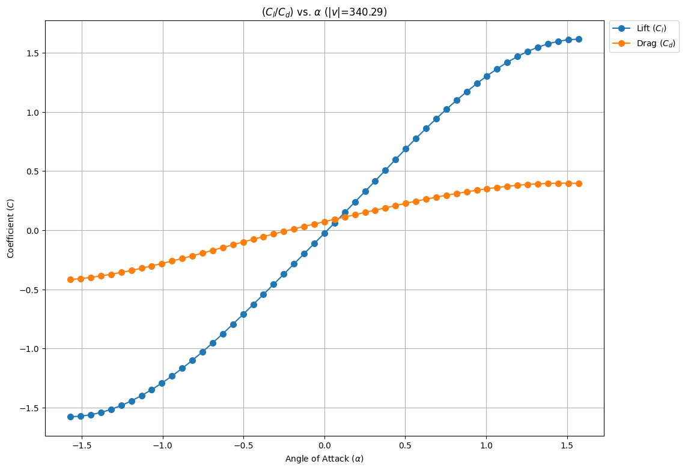

# Example repository using [ifoam](https://github.com/iydon/of.yaml) library
## Dependency Management
| Tool                                              | File                                                   |
| ------------------------------------------------- | ------------------------------------------------------ |
| [pip](https://github.com/pypa/pip)                | [requirements.txt](config/requirements.txt)            |
| [pipenv](https://github.com/pypa/pipenv)          | [Pipfile](config/pipenv/Pipfile)                       |
| [poetry](https://github.com/python-poetry/poetry) | [pyproject.toml](config/poetry/pyproject.toml)         |
| [pdm](https://github.com/pdm-project/pdm)         | [config/pdm/pyproject.toml](config/pdm/pyproject.toml) |

## Available Script(s)
| File                      | Description                                                                                                                                                                                                              |
| ------------------------- | ------------------------------------------------------------------------------------------------------------------------------------------------------------------------------------------------------------------------ |
| [main.py](script/main.py) | By changing the angle of attack in the [nacaAirfoil](https://github.com/OpenFOAM/OpenFOAM-7/tree/master/tutorials/compressible/rhoPimpleFoam/RAS/nacaAirfoil) case to find the corresponding lift and drag coefficients. |

## Visualization Result(s)
### [main.py](script/main.py)

